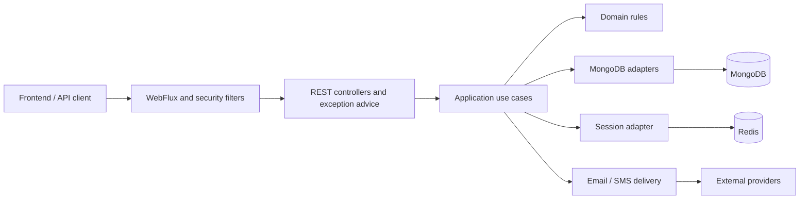

# Backend System Design

## Authority and evidence

This guide owns the backend's runtime model, cross-capability flows, consistency expectations and system security contracts. [ARCHITECTURE.md](ARCHITECTURE.md) owns package boundaries; [DEVELOPMENT.md](DEVELOPMENT.md) owns implementation and verification practices.

**Observed state** below describes the `development` checkout inspected on 2026-09-13. It is source-level evidence, not a production deployment audit or proof that every flow works end to end. **System contracts** govern new work and focused migrations. **Open decisions** remain unresolved; they must not be inferred from prototypes or missing historical plans.

## Runtime context — observed state

The repository builds one Spring Boot application, with Java 21 and Spring Boot 3.3.5 configured in [build.gradle](../build.gradle). HTTP uses Spring WebFlux and Reactor. MongoDB is accessed through reactive persistence adapters; Redis provides session/profile storage capabilities. Email and SMS integrate through Spring Mail and Twilio. Spring Security and JWT cookie infrastructure implement authentication, and springdoc provides OpenAPI integration.

The following diagram is a logical view of components and available capabilities. It does not imply that every request uses Redis or that external delivery is transactionally coordinated.

Deployed topology, service availability, infrastructure sizing and production configuration values were not verified. Version and task declarations remain authoritative in the Gradle build rather than this prose.

## Capability map — observed state

| Capability | Implemented surface and current limits |
|---|---|
| Authentication | Login/logout, registration, verification and credential-update orchestration are present. Current responses and notification handling do not satisfy every target security/reliability contract below. |
| User/profile | Profile updates, friendship operations and wallet relationships are present in `UserService`. Multi-document updates need explicit consistency review. |
| Wallets | Creation, visibility/read access, role-based updates, membership and deletion are present. Deletion contains unfinished member-unlinking work. |
| Accounts | Models, adapters and account-summary queries exist. The account REST controller is entirely commented out; the service retains unfinished detail/create/update work. |
| Transactions | Models and persistence abstractions exist. The REST controller has no operations; transaction service methods return unsupported-operation errors. |

A model, repository or frontend screen is not evidence of a working backend endpoint. [AccountService](../src/main/java/org/efrenjm/investingtracker/application/service/account_management/AccountService.java), [AccountManagementController](../src/main/java/org/efrenjm/investingtracker/interfaces/rest/controller/account_management/AccountManagementController.java) and [TransactionService](../src/main/java/org/efrenjm/investingtracker/application/service/transaction_management/TransactionService.java) are the relevant implementation anchors.

## Authentication and request identity — observed state

1. Login looks up the submitted credential, checks the password and user state, creates a JWT with a unique `jti`, persists an `auth-session:{jti}` record in Redis with a matching TTL, and only then issues the JWT cookie.
2. `JwtAuthenticationFilter` reads the cookie, validates the signature, expiry and `jti`, checks the corresponding Redis session on every request, and only then populates the reactive security context. Missing or unavailable session state remains unauthenticated.
3. Controllers receive transport identity through the existing argument-resolution mechanism and call application ports.
4. Logout invalidates only the current `jti` session and then clears the browser cookie. Multiple sessions for one user remain independent.

Consequently, deleting `auth-session:{jti}` revokes an already-issued JWT on the next protected request. Redis failures fail closed for authentication requests; they are not converted into token-only authentication. Profile-cache entries remain separate and do not grant authorization.

Cookie construction sets HttpOnly and SameSite, but does not explicitly set Secure. `SecurityConfig` currently disables CSRF and configures CORS conditionally. These observations are implementation gaps or deployment questions, not endorsed security defaults.

Evidence: [AuthenticationService](../src/main/java/org/efrenjm/investingtracker/application/service/authentication/AuthenticationService.java), [JwtAuthenticationFilter](../src/main/java/org/efrenjm/investingtracker/interfaces/web/filter/JwtAuthenticationFilter.java), [JwtOperations](../src/main/java/org/efrenjm/investingtracker/infrastructure/jwt/JwtOperations.java), [SecurityConfig](../src/main/java/org/efrenjm/investingtracker/infrastructure/config/SecurityConfig.java).

## Registration and delivery — observed state

Registration distinguishes email/phone input, looks up existing users, creates or refreshes verification state and persists it. Verification delegates validation to domain services. Completing a new registration creates a default account and wallet, links the user and completes the credential update inside an explicit Mongo transaction wrapper.

Delivery helpers invoke internal `subscribe()` calls. Their completion and failure are detached from the returned request publisher; persistence success does not prove provider delivery. No durable delivery guarantee follows from this implementation.

The application throws account-specific exceptions, and authentication advice maps some of them to distinct statuses and bodies. For example, the already-existing-user branch has a conflict response. The target of indistinguishable registration/recovery responses is therefore not an observed current guarantee.

The formerly linked secure-registration plan and BDD are absent from this checkout. Their detailed intended behavior has not been reconstructed. See the [reference audit](../.docs/reviews/2026-09-13-documentation-audit.md).

Evidence: `AuthenticationService` above and [AuthenticationExceptionHandler](../src/main/java/org/efrenjm/investingtracker/interfaces/web/advice/authentication/AuthenticationExceptionHandler.java).

## Data and consistency — observed state

Mongo entities represent users, wallets, accounts and transactions. Adapters map them to core objects. User documents hold relationship references; wallets have role/membership and account structures; accounts contain ownership/sharing references and financial fields.

| Operation or store | Observed guarantee and limit |
|---|---|
| Registration completion | Explicit `TransactionalOperator` wrapping and a configured reactive Mongo transaction manager exist. This does not establish the topology or correctness of a deployed Mongo environment. |
| Wallet creation | Saves a wallet and then links/saves the user; no equivalent transaction wrapper is present in that service method. |
| Membership/friendship updates | Several methods save multiple documents through `Mono.zip`; concurrent completion is not an atomic commit. |
| Wallet deletion | Deletes the wallet with member-unlinking work explicitly unfinished. |
| Redis session/profile storage | Authentication entries use `auth-session:{jti}` and atomic write-with-TTL operations. Profile cache entries remain in their separate `session:` namespace. |
| Financial representation | Account persistence currently uses `Double` for several monetary fields. A complete currency, precision and rounding contract is not established by those field types. |

Do not infer universal uniqueness, optimistic concurrency, idempotency or cross-store atomicity from repository interfaces. Each affected operation needs its own evidence and acceptance criteria.

Evidence: [MongoConfig](../src/main/java/org/efrenjm/investingtracker/infrastructure/config/MongoConfig.java), [WalletService](../src/main/java/org/efrenjm/investingtracker/application/service/wallet_management/WalletService.java), [UserService](../src/main/java/org/efrenjm/investingtracker/application/service/user_service/UserService.java), [RedisUserSessionAdapter](../src/main/java/org/efrenjm/investingtracker/infrastructure/persistence/redis/RedisUserSessionAdapter.java), [AccountEntity](../src/main/java/org/efrenjm/investingtracker/infrastructure/persistence/entity/account/AccountEntity.java).

## System contracts for new work

### Public API and identity

- Public HTTP contracts are defined by active routes, transport DTOs, exception mapping and the approved feature specification. Keep OpenAPI and the frontend aligned when those contracts change.
- Validate transport syntax at the boundary and enforce business invariants in application/domain behavior; architectural placement follows the architecture guide.
- Keep HTTP statuses and response-schema policy at the interface boundary. Errors must not expose provider details or internal representations.
- Preserve indistinguishable public responses where account discovery, registration or recovery could reveal account existence, including status, body, schema, cooldown behavior and provider-delivery details.
- Authentication credentials belong in backend-managed HttpOnly, Secure cookies with an appropriate SameSite policy. Do not place secrets, passwords, OTPs or personal/financial data in URLs.
- CORS with credentials requires explicitly trusted origins; wildcard origins must not be used for credentialed requests.
- New authentication changes must explicitly resolve cookie/CSRF protection, expiry, logout/revocation and role-change behavior rather than assume the current prototype provides the desired guarantees.

### Data integrity and effects

- Enforce correctness through application checks and database constraints where both are required; specify concurrency behavior for each affected operation.
- Treat TTL cleanup as eventual retention, never as the authorization or expiry decision itself.
- Define the atomic unit and partial-failure outcome before introducing a multi-document, cross-store or provider operation. Follow architecture rules for transaction ports.
- Preserve observable completion and errors for correctness-critical effects. External delivery must not change a generic public security response based on account state or provider outcome.
- Keep secrets and provider authentication inside infrastructure adapters. Contributor handling and logging rules are owned by the development guide.

These are governing requirements, not claims of current universal compliance. They retain existing project guidance and identify decisions that future feature work must resolve; this documentation task implements no runtime changes.

## Current limitations and open decisions

| Topic | Follow-up needed before claiming support |
|---|---|
| Secure registration | Recover or replace the absent approved specification; define externally indistinguishable behavior and delivery guarantees. |
| Session lifecycle | Decide how JWT validity relates to Redis, logout, user disablement and role changes; test the selected behavior. |
| Browser security | Resolve the current Secure-cookie and CSRF gaps for the actual deployment. |
| Relationships | Specify atomic updates and deletion cleanup for users, wallets, memberships and accounts. |
| Financial semantics | Define currency, precision, rounding, balance invariants and transaction semantics before implementing financial writes. |
| Incomplete capabilities | Specify and implement missing account/transaction operations; existing placeholders are not an API contract. |
| Delivery and resilience | Define timeouts, retries, deduplication and recovery where required; no outbox, queue or retry policy is mandated or claimed by this guide. |
| Operations | Establish deployment topology, health/readiness criteria, observability, retention and recovery objectives in a dedicated task. No availability or recovery targets are invented here. |
| Logging | Prior guidance identifies sensitive authentication logging debt. Review and remediate it in a scoped security task without reproducing sensitive log content. |

Architectural coupling debt belongs to [ARCHITECTURE.md](ARCHITECTURE.md#boundary-debt). Supporting plans, feature specifications and review evidence belong in `.docs/`; accepted shared decisions must be reflected in this guide rather than left as competing policy.
